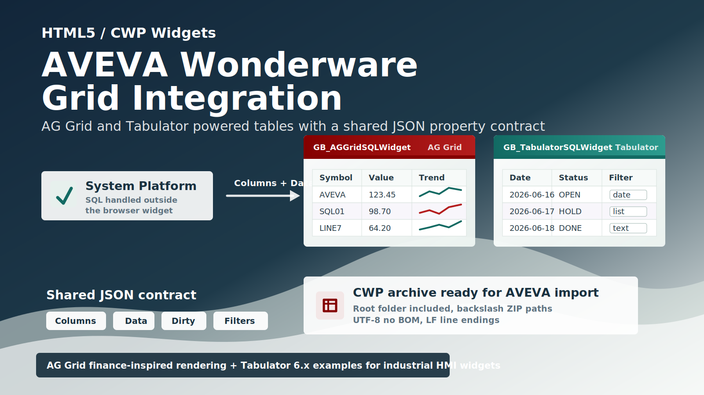

This repository contains two HTML5/CWP widgets for AVEVA Wonderware / AVEVA System Platform:

- `GB_AGGridSQLWidget.cwp`, based on [AG Grid](https://www.ag-grid.com/example-finance/)
- `GB_TabulatorSQLWidget.cwp`, based on [Tabulator 6.x](https://www.tabulator.info/examples/6.x/)

Both widgets expose a common property contract so the same HMI/System Platform logic can feed either grid with JSON column definitions and JSON row data.

## Design Goals

The widgets are designed for AVEVA environments where SQL access and business logic are handled outside the browser widget.

The widget itself:

- does not open direct SQL Server connections
- does not use `fetch` or `XMLHttpRequest`
- reads data from the `Data` widget property
- reads column definitions from the `Columns` widget property
- writes edited rows back to `Data`
- sets `IsDirty` to `True` when a cell edit changes the dataset

This keeps the browser widget focused on visualization and editing, while the HMI/System Platform layer remains responsible for acquiring and publishing data.

## Included Widgets

### GB_AGGridSQLWidget

`GB_AGGridSQLWidget` uses AG Grid Community with the Quartz theme. It follows the finance-style AG Grid example approach: a dense, high-performance grid suitable for structured operational or financial data, with sortable/filterable columns, editable cells, formatting, selection styling, and column sizing.

The CWP archive contains:

```text
GB_AGGridSQLWidget/
  index.html
  widget.wjson
  README.txt
  build/
    build.min.css
    build.min.js
  resources/
    libs/
      ag-grid-community.min.js
      ag-grid.css
      ag-theme-quartz.css
```

Main implementation notes:

- AG Grid is loaded from `./resources/libs/ag-grid-community.min.js`
- the widget uses `ag-theme-quartz`
- filtering is controlled by `IsFilterable`
- editing is controlled by `IsEditable`
- dropdown editors are mapped to AG Grid select editors through `ColumnsOptions`
- column metadata is compatible with field names such as `prop`, `name`, `title`, `size`, and `minSize`

### GB_TabulatorSQLWidget

`GB_TabulatorSQLWidget` uses Tabulator 6.x. It follows the Tabulator examples model for interactive data tables: JSON data, editable cells, sortable columns, header filters, formatters, responsive column definitions, and local data rendering.

The CWP archive contains:

```text
GB_TabulatorSQLWidget/
  index.html
  widget.wjson
  README.txt
  build/
    build.min.css
    build.min.js
  resources/
    libs/
      tabulator.min.css
      tabulator.min.js
```

Main implementation notes:

- Tabulator is loaded from `./resources/libs/tabulator.min.js`
- filtering is controlled by `IsFilterable`
- editing is controlled by `IsEditable`
- dropdown editors are mapped to Tabulator list editors through `ColumnsOptions`
- date-like columns can use an HTML5 calendar filter when `DateFilterAsCalendar=True`
- column metadata is compatible with field names such as `prop`, `name`, `headerName`, and `size`

## Widget Property Contract

Both widgets use these core properties:

| Property | Type | Purpose |
| --- | --- | --- |
| `Columns` | String | JSON array of column definitions. |
| `Data` | String | JSON array of row objects. |
| `FontSize` | Integer | Cell font size in points. |
| `HeaderHeight` | Integer | Header height in pixels. |
| `HeaderFontSize` | Integer | Header font size in points. |
| `RowHeight` | Integer | Row height in pixels. |
| `IsDirty` | Boolean | Set by the widget when edited data is published back to `Data`. |
| `IsEditable` | Boolean | Enables or disables cell editing. |
| `IsFilterable` | Boolean | Enables or disables column/header filtering. |
| `IsDebugMode` | Boolean | Enables console logging for diagnostics. |
| `ColumnsProperties` | String | JSON array with additional per-column options. |
| `ColumnsOptions` | String | JSON array with dropdown/list options per column. |
| `HeaderBackgroundColor` | String | Header background color. |
| `HeaderTextColor` | String | Header text color. |
| `OddRowBackgroundColor` | String | Odd row background color. |
| `EvenRowBackgroundColor` | String | Even row background color. |
| `SelectedRowBackgroundColor` | String | Selected row background color. |
| `RowTextColor` | String | Row text color. |
| `BorderColor` | String | Grid border color. |

`GB_TabulatorSQLWidget` also includes:

| Property | Type | Purpose |
| --- | --- | --- |
| `DateFilterAsCalendar` | Boolean | Uses an HTML5 date input for date-like header filters. |

## Column Definitions

The `Columns` property must contain a JSON array. Each object describes one grid column.

Example:

```json
[
  {
    "prop": "Symbol",
    "name": "Symbol",
    "size": 90
  },
  {
    "prop": "Description",
    "name": "Description",
    "size": 220
  },
  {
    "prop": "LastPrice",
    "name": "Last Price",
    "size": 120,
    "formatting": "decimal2"
  },
  {
    "prop": "TradeDate",
    "name": "Trade Date",
    "size": 130,
    "formatting": "date"
  }
]
```

Supported compatibility aliases:

| Generic field | AG Grid mapping | Tabulator mapping |
| --- | --- | --- |
| `prop` | `field` | `field` |
| `name` | `headerName` | `title` |
| `title` | `headerName` | `title` |
| `headerName` | `headerName` | `title` |
| `size` | `width` | `width` |
| `minSize` | `minWidth` | custom column property if supported |

If `Columns` is empty and `Data` contains at least one row, the widgets infer columns from the keys in the first row.

## Row Data

The `Data` property must contain a JSON array of objects. Object keys must match the column `prop` or `field` values.

Example:

```json
[
  {
    "Symbol": "AVEVA",
    "Description": "Industrial software portfolio",
    "LastPrice": 123.45,
    "TradeDate": "2026-06-16"
  },
  {
    "Symbol": "SQL01",
    "Description": "Historian query result",
    "LastPrice": 98.7,
    "TradeDate": "2026-06-17"
  }
]
```

When a user edits a cell:

1. the widget updates its internal grid data
2. the complete row array is serialized back into `Data`
3. `IsDirty` is set to `True`

The HMI/System Platform layer can watch `IsDirty`, process the changed `Data`, and then reset `IsDirty` when the change has been handled.

## Formatting

The widgets support the following `formatting` values:

| Value | Output |
| --- | --- |
| `date` | Localized date using `it-IT`. |
| `time` | Localized time using `it-IT`. |
| `datetime` | Localized date and time using `it-IT`. |
| `integer` | Integer with localized separators. |
| `decimal` | Decimal with localized separators. |
| `decimal1` | Decimal with one fixed fraction digit. |
| `decimal2` | Decimal with two fixed fraction digits. |
| `decimal3` | Decimal with three fixed fraction digits. |

Example:

```json
[
  {
    "prop": "Quantity",
    "name": "Quantity",
    "formatting": "integer",
    "size": 100
  },
  {
    "prop": "Value",
    "name": "Value",
    "formatting": "decimal2",
    "size": 120
  }
]
```

## Dropdown Columns

Use `ColumnsOptions` to define dropdown/list values by column index.

Example:

```json
[
  [],
  [
    { "value": "OPEN", "text": "Open" },
    { "value": "CLOSED", "text": "Closed" },
    { "value": "HOLD", "text": "On Hold" }
  ],
  []
]
```

For a column at the same index:

```json
[
  { "prop": "Id", "name": "ID", "size": 80 },
  {
    "prop": "Status",
    "name": "Status",
    "size": 120,
    "optionsValue": "value",
    "optionsText": "text"
  },
  { "prop": "Notes", "name": "Notes", "size": 250 }
]
```

AG Grid uses the option values as select editor values. Tabulator uses value/text pairs when available.

## Additional Column Properties

Use `ColumnsProperties` to merge advanced options into each column by index.

Example:

```json
[
  {
    "pinned": "left",
    "readonly": true
  },
  {
    "hozAlign": "right",
    "sorter": "number"
  }
]
```

Because AG Grid and Tabulator use different option names, keep shared column definitions simple and put library-specific options in `ColumnsProperties` only when the selected widget supports them.

## Filtering

Set `IsFilterable=True` to enable filtering.

For AG Grid:

- filters are enabled at column level
- filter buttons are visible in the header
- setting `filter:false` on a column disables filtering for that column

For Tabulator:

- header filters are enabled at column level
- string columns use text inputs by default
- date-like columns can use a calendar input when `DateFilterAsCalendar=True`
- date-like detection uses `formatting:"date"`, `formatting:"datetime"`, or labels/fields containing values such as `date`, `data`, or `giorno`

Set `IsFilterable=False` to clear and disable filters.

## Styling

The widgets expose color properties so the same CWP can be themed from AVEVA without rebuilding the archive.

Default palette:

```text
HeaderBackgroundColor     #840000
HeaderTextColor           #ffffff
OddRowBackgroundColor     #ffffff
EvenRowBackgroundColor    #f8f6fb
SelectedRowBackgroundColor #fef2c6
RowTextColor              #222222
BorderColor               #dddddd
```

Both widgets use `Calibri Light` first, with standard web font fallbacks.

## HTML Entry Point

Each widget loads the AVEVA widget proxy from:

```html
<script src="../resources/apis/proxy.js" cwidget="widget" autoResize="disable"></script>
```

The grid fills the full widget area:

```html
<div id="grid"></div>
```

For AG Grid, the element also includes the AG Grid theme class:

```html
<div id="grid" class="ag-theme-quartz"></div>
```

## Building CWP Archives

Use `CWP Archive Generator.ps1` to create the CWP archives. The script is important because it produces the internal archive layout expected by AVEVA.

The script:

- includes the widget root folder inside the archive
- writes internal ZIP paths with backslashes
- adds file entries only, without explicit directory entries
- sorts files by full path before adding them
- normalizes text files to UTF-8 without BOM
- normalizes text line endings to LF
- preserves binary files as raw bytes
- resolves relative output paths from the current PowerShell directory instead of `C:\Windows\System32`

Example:

```powershell
.\CWP Archive Generator.ps1 `
  -SourceFolder ".\GB_AGGridSQLWidget" `
  -OutputCwp ".\GB_AGGridSQLWidget.cwp"
```

```powershell
.\CWP Archive Generator.ps1 `
  -SourceFolder ".\GB_TabulatorSQLWidget" `
  -OutputCwp ".\GB_TabulatorSQLWidget.cwp"
```

Run the command from the folder that contains both the widget source folder and `CWP Archive Generator.ps1`.

Expected archive root examples:

```text
GB_AGGridSQLWidget\index.html
GB_AGGridSQLWidget\widget.wjson
GB_AGGridSQLWidget\build\build.min.js
```

```text
GB_TabulatorSQLWidget\index.html
GB_TabulatorSQLWidget\widget.wjson
GB_TabulatorSQLWidget\build\build.min.js
```

Do not create a CWP by manually compressing only the files inside the widget folder. The archive must contain the widget root folder as the first path segment.

## Import and Runtime Checklist

Before importing a CWP into AVEVA:

- verify that `index.html` is at `<WidgetName>\index.html` inside the archive
- verify that `widget.wjson` is at `<WidgetName>\widget.wjson`
- verify that all JavaScript and CSS libraries are under `<WidgetName>\resources\libs\`
- verify that text files are UTF-8 without BOM
- verify that the widget receives valid JSON strings in `Columns` and `Data`
- verify that `IsEditable`, `IsFilterable`, and color properties are set as expected

At runtime:

- publish rows to `Data`
- publish columns to `Columns`
- use `ColumnsOptions` for dropdown/list editors
- use `ColumnsProperties` for advanced per-column behavior
- watch `IsDirty` to detect user edits
- read the updated `Data` value after edits

## Choosing a Widget

Use `GB_AGGridSQLWidget` when you want an AG Grid style table with Quartz theming, fast column sizing, AG Grid filtering, and a finance-dashboard style foundation.

Use `GB_TabulatorSQLWidget` when you want a Tabulator 6.x style table with header filters, list editors, local data behavior, and flexible Tabulator column configuration.

Both widgets are intentionally fed through the same JSON property contract, so switching between them should mostly require adapting only advanced library-specific column options.
