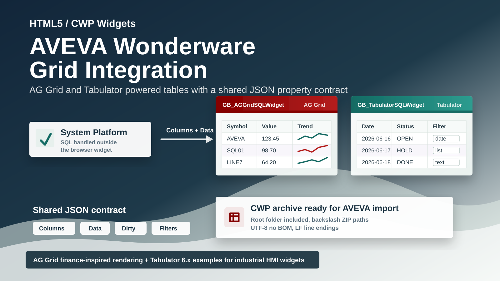

This repository contains three HTML5/CWP widgets for AVEVA Wonderware / AVEVA System Platform:

- `GB_AGGridSQLWidget.cwp`, based on [AG Grid](https://www.ag-grid.com/example-finance/)
- `GB_AGGridSQLWidget_mod.cwp`, a modified AG Grid build available from [GB_AGGridSQLWidget_mod.cwp](https://github.com/michele-tn/AVEVA-Wonderware-HTML5-Grid-Widgets/raw/refs/heads/main/GB_AGGridSQLWidget_mod.cwp)
- `GB_AGGridSQLWidget_mod2.cwp`, a second modified AG Grid build available from [GB_AGGridSQLWidget_mod2.cwp](https://github.com/michele-tn/AVEVA-Wonderware-HTML5-Grid-Widgets/raw/refs/heads/main/GB_AGGridSQLWidget_mod2.cwp)
- `GB_TabulatorSQLWidget.cwp`, based on [Tabulator 6.x](https://www.tabulator.info/examples/6.x/)

All widgets expose common properties so the same HMI/System Platform logic can feed each grid with JSON column definitions and JSON row data.

## Design Goals

The widgets are designed for AVEVA environments where SQL access and business logic are handled outside the browser widget.

The widget itself:

- does not open direct SQL Server connections
- does not use `fetch` or `XMLHttpRequest`
- reads data from the `Data` widget property
- reads column definitions from the `Columns` widget property
- writes edited rows back to `Data`
- sets `IsDirty` to `True` when a cell edit changes the dataset

This keeps the browser widget focused on visualization and editing, while the HMI/System Platform layer remains responsible for acquiring and publishing data.

## Included Widgets

### GB_AGGridSQLWidget

`GB_AGGridSQLWidget` uses AG Grid Community with the Quartz theme. It follows the finance-style AG Grid example approach: a dense, high-performance grid suitable for structured operational or financial data, with sortable/filterable columns, editable cells, formatting, selection styling, and column sizing.

The CWP archive contains:

```text
GB_AGGridSQLWidget/
  index.html
  widget.wjson
  README.txt
  build/
    build.min.css
    build.min.js
  resources/
    libs/
      ag-grid-community.min.js
      ag-grid.css
      ag-theme-quartz.css
```

Main implementation notes:

- AG Grid is loaded from `./resources/libs/ag-grid-community.min.js`
- the widget uses `ag-theme-quartz`
- filtering is controlled by `IsFilterable`
- editing is controlled by `IsEditable`
- dropdown editors are mapped to AG Grid select editors through `ColumnsOptions`
- column metadata is compatible with field names such as `prop`, `name`, `title`, `size`, and `minSize`

<details>
<summary><strong>Click to show GB_AGGridSQLWidget_mod updates</strong></summary>

### GB_AGGridSQLWidget_mod

`GB_AGGridSQLWidget_mod` is a modified AG Grid CWP widget for AVEVA Wonderware / AVEVA System Platform. It keeps the same external data contract as the standard AG Grid widget while adding color fixes, conditional cell styling, and parsing improvements for AVEVA-style JSON strings.

Download the modified widget archive here:

[GB_AGGridSQLWidget_mod.cwp](https://github.com/michele-tn/AVEVA-Wonderware-HTML5-Grid-Widgets/raw/refs/heads/main/GB_AGGridSQLWidget_mod.cwp)

The CWP archive contains:

```text
GB_AGGridSQLWidget_mod/
  index.html
  widget.wjson
  README.txt
  build/
    build.min.css
    build.min.js
  resources/
    libs/
      ag-grid-community.min.js
      ag-grid.css
      ag-theme-quartz.css
```

Widget property contract:

- `Columns`: JSON array of column definitions.
- `Data`: JSON array of row objects.
- `FontSize`, `HeaderHeight`, `HeaderFontSize`, `RowHeight`: grid appearance settings.
- `IsDirty`: written by the widget when a cell is modified.
- `IsEditable`: enables or disables editing.
- `IsDebugMode`: enables console logging.
- `ColumnsProperties`: JSON array of additional per-column attributes.
- `ColumnsOptions`: JSON array of dropdown options per column.
- `ConditionalCellStyles`: JSON array of rules used to change cell text/background styling from row data.

As with the standard widgets, `GB_AGGridSQLWidget_mod` does not open direct SQL Server connections and does not use `fetch` or `XMLHttpRequest`. SQL Server access must be handled by the HMI/System Platform layer, which publishes rows to `Data` and column definitions to `Columns`.

Main updates in the modified version:

- Adds customizable alternating row colors.
- Adds color properties for header, rows, selected row, text, and border styling.
- Adds the `ConditionalCellStyles` widget property.
- Refreshes cells after a cell edit so conditional styles are recalculated immediately.
- Accepts JSON passed by AVEVA as a quoted string.
- Accepts AVEVA strings with doubled internal quotes, such as `"[{""field"":""Value""}]"`.
- Allows `ColumnsProperties` to be provided either as a JSON array or as a pipe-separated list, such as `{"editable":false}|{"filter":false}`.
- Matches conditional-style field names even when accents or case differ, for example `Quantita` and `Quantità`.
- Honors `editable:false`, `readonly:true`, `readOnly:true`, `filter:false`, `filterable:false`, and `isFilterable:false` from `ColumnsProperties`.
- Generates the CWP archive with the layout expected by `New-CwpFromFolder_CORRETTO.ps1`: ZIP entries use backslashes, the root widget folder is included, and explicit directory entries are omitted.

Example `ConditionalCellStyles` value:

```json
[
  {
    "targetField": "Quantity",
    "when": {
      "field": "Notes",
      "operator": "notEmpty"
    },
    "textColor": "#ff0000"
  },
  {
    "targetField": "Quantity",
    "when": {
      "field": "Quantity",
      "operator": ">",
      "value": 300
    },
    "textColor": "#ff0000",
    "backgroundColor": "#fff2cc"
  }
]
```

Supported conditional-style fields:

- target field aliases: `targetField`, `target`, `column`
- condition fields: `when.field`, `when.operator`, `when.value`
- positive style fields: `textColor`, `color`, `backgroundColor`, `bgColor`, `fontWeight`, `fontStyle`
- fallback style fields: `elseTextColor`, `elseColor`, `elseBackgroundColor`, `elseBgColor`, `elseFontWeight`, `elseFontStyle`

Supported operators:

```text
notEmpty, empty, notNull, isNull, equals, notEquals, contains,
startsWith, endsWith, in, notIn, >, >=, <, <=
```

</details>

<details>
<summary><strong>Click to show GB_AGGridSQLWidget_mod2 updates</strong></summary>

### GB_AGGridSQLWidget_mod2

`GB_AGGridSQLWidget_mod2` starts from the `GB_AGGridSQLWidget_mod` behavior and adds the runtime features needed to read the selected row/cell from HMI scripts and to control editability/filterability more strictly from widget properties.

Download the MOD2 widget archive here:

[GB_AGGridSQLWidget_mod2.cwp](https://github.com/michele-tn/AVEVA-Wonderware-HTML5-Grid-Widgets/raw/refs/heads/main/GB_AGGridSQLWidget_mod2.cwp)

Versioned release package:

[GB_AGGridSQLWidget_mod2_RELEASE_v2026.08.20_1350.7z](https://github.com/michele-tn/AVEVA-Wonderware-HTML5-Grid-Widgets/raw/refs/heads/main/GB_AGGridSQLWidget_mod2_RELEASE_v2026.08.20_1350.7z)

Versioning rule for AVEVA Wonderware: the importable CWP file must keep the exact name `GB_AGGridSQLWidget_mod2.cwp`, and the internal widget name must remain `GB_AGGridSQLWidget_mod2`. Versioning is applied only to the external release folder/package, never to the CWP file name used for import.

The CWP archive contains:

```text
GB_AGGridSQLWidget_mod2/
  index.html
  widget.wjson
  README.md
  build/
    build.min.css
    build.min.js
  resources/
    libs/
      ag-grid-community.min.js
      ag-grid.css
      ag-theme-quartz.css
```

Additional widget properties in `mod2`:

- `SelectedRowIndex`: index of the last clicked/edited row, or `-1` when unavailable.
- `SelectedColumnField`: field name of the last clicked/edited cell.
- `SelectedCellValue`: value of the last clicked/edited cell as a string.
- `SelectedRowData`: complete selected/edited row as a JSON string.

Selection properties are updated on cell click, row click, selection change, and cell edit. Row events update `SelectedRowData` and `SelectedRowIndex` without clearing the last cell field/value produced by a cell event.

Suggested HMI wrapper bindings:

```text
GB_AGGridSQLWidget_mod2.SelectedRowIndex = SelectedRowIndex
GB_AGGridSQLWidget_mod2.SelectedColumnField = SelectedColumnField
GB_AGGridSQLWidget_mod2.SelectedCellValue = SelectedCellValue
GB_AGGridSQLWidget_mod2.SelectedRowData = SelectedRowData
```

Suggested custom property types:

| Property | Type |
| --- | --- |
| `SelectedRowIndex` | Integer |
| `SelectedColumnField` | String |
| `SelectedCellValue` | String |
| `SelectedRowData` | String |

Editability in `mod2` is deny-by-default:

- when `IsEditable=False`, no column is editable;
- when `IsEditable=True`, a column is editable only if the column definition or `ColumnsProperties` marks it with `{"editable":true}`;
- `readonly:true` or `readOnly:true` always disables editing for that column;
- for compatibility with production screens, quantity and production-note columns can also be recognized as editable when global editing is enabled.

Example `ColumnsProperties` for making only quantity and notes editable:

```json
[
  {"filter":false,"editable":false},
  {"filter":false,"editable":false},
  {"filter":false,"editable":false},
  {"filter":false,"editable":true},
  {"filter":false,"editable":true}
]
```

When `IsFilterable=False`, `mod2`:

- clears active filters;
- regenerates column definitions with `filter=false`;
- disables floating filters;
- suppresses header filter/menu buttons;
- removes filter menu tabs and filter parameters;
- blocks click events on residual filter icons;
- hides residual AG Grid filter/menu icons with CSS on the grid container and on the embedded document root/body.

Suggested HMI wrapper binding:

```text
GB_AGGridSQLWidget_mod2.IsFilterable = GB_AGGridIsFilterable
GB_AGGridIsFilterable = False
```

`mod2` also keeps the previous fixes for conditional styles, AVEVA-style quoted JSON parsing, explicit column widths, font sizing, row/header colors, and dirty-data publishing.

Visual demo:


The grid can publish the selected/edited cell context while keeping the configured editability rules.


The HMI log shows `SelectedRowIndex`, `SelectedColumnField`, `SelectedCellValue`, and `SelectedRowData` populated from the selected cell.

</details>

### GB_TabulatorSQLWidget

`GB_TabulatorSQLWidget` uses Tabulator 6.x. It follows the Tabulator examples model for interactive data tables: JSON data, editable cells, sortable columns, header filters, formatters, responsive column definitions, and local data rendering.

The CWP archive contains:

```text
GB_TabulatorSQLWidget/
  index.html
  widget.wjson
  README.txt
  build/
    build.min.css
    build.min.js
  resources/
    libs/
      tabulator.min.css
      tabulator.min.js
```

Main implementation notes:

- Tabulator is loaded from `./resources/libs/tabulator.min.js`
- filtering is controlled by `IsFilterable`
- editing is controlled by `IsEditable`
- dropdown editors are mapped to Tabulator list editors through `ColumnsOptions`
- date-like columns can use an HTML5 calendar filter when `DateFilterAsCalendar=True`
- column metadata is compatible with field names such as `prop`, `name`, `headerName`, and `size`

## Widget Properties

All widgets use these core properties:

| Property | Type | Purpose |
| --- | --- | --- |
| `Columns` | String | JSON array of column definitions. |
| `Data` | String | JSON array of row objects. |
| `FontSize` | Integer | Cell font size in points. |
| `HeaderHeight` | Integer | Header height in pixels. |
| `HeaderFontSize` | Integer | Header font size in points. |
| `RowHeight` | Integer | Row height in pixels. |
| `IsDirty` | Boolean | Set by the widget when edited data is published back to `Data`. |
| `IsEditable` | Boolean | Enables or disables cell editing. |
| `IsFilterable` | Boolean | Enables or disables column/header filtering. |
| `IsDebugMode` | Boolean | Enables console logging for diagnostics. |
| `ColumnsProperties` | String | JSON array with additional per-column options. |
| `ColumnsOptions` | String | JSON array with dropdown/list options per column. |
| `HeaderBackgroundColor` | String | Header background color. |
| `HeaderTextColor` | String | Header text color. |
| `OddRowBackgroundColor` | String | Odd row background color. |
| `EvenRowBackgroundColor` | String | Even row background color. |
| `SelectedRowBackgroundColor` | String | Selected row background color. |
| `RowTextColor` | String | Row text color. |
| `BorderColor` | String | Grid border color. |

`GB_TabulatorSQLWidget` also includes:

| Property | Type | Purpose |
| --- | --- | --- |
| `DateFilterAsCalendar` | Boolean | Uses an HTML5 date input for date-like header filters. |

`GB_AGGridSQLWidget_mod` also includes:

| Property | Type | Purpose |
| --- | --- | --- |
| `ConditionalCellStyles` | String | JSON array of conditional rules used to change cell text, background, font weight, and font style from row data. |

`GB_AGGridSQLWidget_mod2` also includes all `mod` properties plus:

| Property | Type | Purpose |
| --- | --- | --- |
| `SelectedRowIndex` | Integer | Index of the last selected/edited row. |
| `SelectedColumnField` | String | Field name of the last selected/edited cell. |
| `SelectedCellValue` | String | Value of the last selected/edited cell. |
| `SelectedRowData` | String | Full selected/edited row as JSON. |

## Column Definitions

The `Columns` property must contain a JSON array. Each object describes one grid column.

Example:

```json
[
  {
    "prop": "Symbol",
    "name": "Symbol",
    "size": 90
  },
  {
    "prop": "Description",
    "name": "Description",
    "size": 220
  },
  {
    "prop": "LastPrice",
    "name": "Last Price",
    "size": 120,
    "formatting": "decimal2"
  },
  {
    "prop": "TradeDate",
    "name": "Trade Date",
    "size": 130,
    "formatting": "date"
  }
]
```

Supported compatibility aliases:

| Generic field | AG Grid mapping | Tabulator mapping |
| --- | --- | --- |
| `prop` | `field` | `field` |
| `name` | `headerName` | `title` |
| `title` | `headerName` | `title` |
| `headerName` | `headerName` | `title` |
| `size` | `width` | `width` |
| `minSize` | `minWidth` | custom column property if supported |

If `Columns` is empty and `Data` contains at least one row, the widgets infer columns from the keys in the first row.

## Row Data

The `Data` property must contain a JSON array of objects. Object keys must match the column `prop` or `field` values.

Example:

```json
[
  {
    "Symbol": "AVEVA",
    "Description": "Industrial software portfolio",
    "LastPrice": 123.45,
    "TradeDate": "2026-06-16"
  },
  {
    "Symbol": "SQL01",
    "Description": "Historian query result",
    "LastPrice": 98.7,
    "TradeDate": "2026-06-17"
  }
]
```

When a user edits a cell:

1. the widget updates its internal grid data
2. the complete row array is serialized back into `Data`
3. `IsDirty` is set to `True`

The HMI/System Platform layer can watch `IsDirty`, process the changed `Data`, and then reset `IsDirty` when the change has been handled.

## Formatting

The widgets support the following `formatting` values:

| Value | Output |
| --- | --- |
| `date` | Localized date using `it-IT`. |
| `time` | Localized time using `it-IT`. |
| `datetime` | Localized date and time using `it-IT`. |
| `integer` | Integer with localized separators. |
| `decimal` | Decimal with localized separators. |
| `decimal1` | Decimal with one fixed fraction digit. |
| `decimal2` | Decimal with two fixed fraction digits. |
| `decimal3` | Decimal with three fixed fraction digits. |

Example:

```json
[
  {
    "prop": "Quantity",
    "name": "Quantity",
    "formatting": "integer",
    "size": 100
  },
  {
    "prop": "Value",
    "name": "Value",
    "formatting": "decimal2",
    "size": 120
  }
]
```

## Dropdown Columns

Use `ColumnsOptions` to define dropdown/list values by column index.

Example:

```json
[
  [],
  [
    { "value": "OPEN", "text": "Open" },
    { "value": "CLOSED", "text": "Closed" },
    { "value": "HOLD", "text": "On Hold" }
  ],
  []
]
```

For a column at the same index:

```json
[
  { "prop": "Id", "name": "ID", "size": 80 },
  {
    "prop": "Status",
    "name": "Status",
    "size": 120,
    "optionsValue": "value",
    "optionsText": "text"
  },
  { "prop": "Notes", "name": "Notes", "size": 250 }
]
```

AG Grid uses the option values as select editor values. Tabulator uses value/text pairs when available.

## Additional Column Properties

Use `ColumnsProperties` to merge advanced options into each column by index.

Example:

```json
[
  {
    "pinned": "left",
    "readonly": true
  },
  {
    "hozAlign": "right",
    "sorter": "number"
  }
]
```

Because AG Grid and Tabulator use different option names, keep shared column definitions simple and put library-specific options in `ColumnsProperties` only when the selected widget supports them.

`GB_AGGridSQLWidget_mod` also accepts `ColumnsProperties` as a pipe-separated list when AVEVA integration makes a plain JSON array inconvenient:

```text
{"editable":false}|{"filter":false}
```

`GB_AGGridSQLWidget_mod2` uses the same formats and applies editability/filterability with a stricter final pass after all column metadata is merged. This prevents a later `ColumnsProperties` merge from re-enabling a filter or editor that was disabled by global widget properties.

For the modified AG Grid widget, the following column flags are recognized when present in `ColumnsProperties`:

```text
editable:false, readonly:true, readOnly:true,
filter:false, filterable:false, isFilterable:false
```

## Filtering

Set `IsFilterable=True` to enable filtering.

For AG Grid:

- filters are enabled at column level
- filter buttons are visible in the header
- setting `filter:false` on a column disables filtering for that column

For Tabulator:

- header filters are enabled at column level
- string columns use text inputs by default
- date-like columns can use a calendar input when `DateFilterAsCalendar=True`
- date-like detection uses `formatting:"date"`, `formatting:"datetime"`, or labels/fields containing values such as `date`, `data`, or `giorno`

Set `IsFilterable=False` to clear and disable filters.

## Styling

The widgets expose color properties so the same CWP can be themed from AVEVA without rebuilding the archive.

Default palette:

```text
HeaderBackgroundColor     #840000
HeaderTextColor           #ffffff
OddRowBackgroundColor     #ffffff
EvenRowBackgroundColor    #f8f6fb
SelectedRowBackgroundColor #fef2c6
RowTextColor              #222222
BorderColor               #dddddd
```

Both widgets use `Calibri Light` first, with standard web font fallbacks.

`GB_AGGridSQLWidget_mod` and `GB_AGGridSQLWidget_mod2` support conditional cell styling through the `ConditionalCellStyles` property. Rules are evaluated against row data and can update the target cell text color, background color, font weight, and font style.

Example:

```json
[
  {
    "targetField": "Quantity",
    "when": {
      "field": "Notes",
      "operator": "notEmpty"
    },
    "textColor": "#ff0000"
  },
  {
    "targetField": "Quantity",
    "when": {
      "field": "Quantity",
      "operator": ">",
      "value": 300
    },
    "textColor": "#ff0000",
    "backgroundColor": "#fff2cc"
  }
]
```

Supported conditional-style fields:

- target field aliases: `targetField`, `target`, `column`
- condition fields: `when.field`, `when.operator`, `when.value`
- positive style fields: `textColor`, `color`, `backgroundColor`, `bgColor`, `fontWeight`, `fontStyle`
- fallback style fields: `elseTextColor`, `elseColor`, `elseBackgroundColor`, `elseBgColor`, `elseFontWeight`, `elseFontStyle`

Supported operators:

```text
notEmpty, empty, notNull, isNull, equals, notEquals, contains,
startsWith, endsWith, in, notIn, >, >=, <, <=
```

After a cell edit, `GB_AGGridSQLWidget_mod` and `GB_AGGridSQLWidget_mod2` refresh cells so conditional styles are recalculated immediately. They also match field names across case and accent differences, for example `Quantita` and `Quantità`.

When AVEVA passes JSON as a quoted string, or with doubled internal quotes such as `"[{""field"":""Value""}]"`, the modified AG Grid widget normalizes the value before parsing it.

`GB_AGGridSQLWidget_mod2` additionally publishes selected-cell information to `SelectedRowIndex`, `SelectedColumnField`, `SelectedCellValue`, and `SelectedRowData`, so HMI scripts can read the current grid context without parsing the whole `Data` payload.

## HTML Entry Point

Each widget loads the AVEVA widget proxy from:

```html
<script src="../resources/apis/proxy.js" cwidget="widget" autoResize="disable"></script>
```

The grid fills the full widget area:

```html
<div id="grid"></div>
```

For AG Grid, the element also includes the AG Grid theme class:

```html
<div id="grid" class="ag-theme-quartz"></div>
```

## Building CWP Archives

Use `CWP Archive Generator.ps1` to create the CWP archives. The script is important because it produces the internal archive layout expected by AVEVA.

The script:

- includes the widget root folder inside the archive
- writes internal ZIP paths with backslashes
- adds file entries only, without explicit directory entries
- sorts files by full path before adding them
- normalizes text files to UTF-8 without BOM
- normalizes text line endings to LF
- preserves binary files as raw bytes
- resolves relative output paths from the current PowerShell directory instead of `C:\Windows\System32`

Example:

```powershell
.\CWP Archive Generator.ps1 `
  -SourceFolder ".\GB_AGGridSQLWidget" `
  -OutputCwp ".\GB_AGGridSQLWidget.cwp"
```

```powershell
.\CWP Archive Generator.ps1 `
  -SourceFolder ".\GB_AGGridSQLWidget_mod" `
  -OutputCwp ".\GB_AGGridSQLWidget_mod.cwp"
```

```powershell
.\CWP Archive Generator.ps1 `
  -SourceFolder ".\GB_AGGridSQLWidget_mod2" `
  -OutputCwp ".\GB_AGGridSQLWidget_mod2.cwp"
```

```powershell
.\CWP Archive Generator.ps1 `
  -SourceFolder ".\GB_TabulatorSQLWidget" `
  -OutputCwp ".\GB_TabulatorSQLWidget.cwp"
```

Run the command from the folder that contains both the widget source folder and `CWP Archive Generator.ps1`.

Expected archive root examples:

```text
GB_AGGridSQLWidget\index.html
GB_AGGridSQLWidget\widget.wjson
GB_AGGridSQLWidget\build\build.min.js
```

```text
GB_AGGridSQLWidget_mod\index.html
GB_AGGridSQLWidget_mod\widget.wjson
GB_AGGridSQLWidget_mod\build\build.min.js
```

```text
GB_AGGridSQLWidget_mod2\index.html
GB_AGGridSQLWidget_mod2\widget.wjson
GB_AGGridSQLWidget_mod2\build\build.min.js
```

```text
GB_TabulatorSQLWidget\index.html
GB_TabulatorSQLWidget\widget.wjson
GB_TabulatorSQLWidget\build\build.min.js
```

Do not create a CWP by manually compressing only the files inside the widget folder. The archive must contain the widget root folder as the first path segment.

## Import and Runtime Checklist

Before importing a CWP into AVEVA:

- verify that `index.html` is at `<WidgetName>\index.html` inside the archive
- verify that `widget.wjson` is at `<WidgetName>\widget.wjson`
- verify that all JavaScript and CSS libraries are under `<WidgetName>\resources\libs\`
- verify that text files are UTF-8 without BOM
- verify that the widget receives valid JSON strings in `Columns` and `Data`
- verify that `IsEditable`, `IsFilterable`, and color properties are set as expected
- for `GB_AGGridSQLWidget_mod`, verify that `ConditionalCellStyles` is valid JSON when conditional styling is used
- for `GB_AGGridSQLWidget_mod2`, verify the wrapper bindings for `SelectedRowIndex`, `SelectedColumnField`, `SelectedCellValue`, `SelectedRowData`, `IsEditable`, and `IsFilterable`

At runtime:

- publish rows to `Data`
- publish columns to `Columns`
- use `ColumnsOptions` for dropdown/list editors
- use `ColumnsProperties` for advanced per-column behavior
- use `ConditionalCellStyles` with `GB_AGGridSQLWidget_mod` for row-data-driven cell styling
- use `SelectedRowIndex`, `SelectedColumnField`, `SelectedCellValue`, and `SelectedRowData` with `GB_AGGridSQLWidget_mod2` when HMI scripts must read the selected grid context
- watch `IsDirty` to detect user edits
- read the updated `Data` value after edits

## Choosing a Widget

Use `GB_AGGridSQLWidget` when you want an AG Grid style table with Quartz theming, fast column sizing, AG Grid filtering, and a finance-dashboard style foundation.

Use `GB_AGGridSQLWidget_mod` when you want the AG Grid foundation plus AVEVA-friendly parsing, customizable row/header colors, immediate conditional-style refresh after edits, and `ConditionalCellStyles` rules.

Use `GB_AGGridSQLWidget_mod2` when you want the `mod` behavior plus selected-cell publishing for HMI scripts and stricter runtime control over editable/filterable columns.

Use `GB_TabulatorSQLWidget` when you want a Tabulator 6.x style table with header filters, list editors, local data behavior, and flexible Tabulator column configuration.

All widgets are intentionally fed through the same JSON property, so switching between them should mostly require adapting only advanced library-specific column options.
